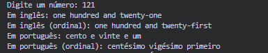

 <!-- HEADER -->

<!-- TÍTULO -->
<h1 align="center" alt="title">
  
    <b> CONVERT NUMBERS TO WORDS </b>
  
</h1>

 

**num2words** is a library that converts numbers like **42** to words like **forty-two**. It supports multiple languages (see the list below for full list of languages) and can even generate ordinal numbers like forty-second (although this last feature is a bit buggy for some languages at the moment).

 

<!-- Skills -->
&nbsp;
&nbsp;

---

<!-- Projects -->
**Print**

---
<!-- FOOTER -->
 

  <table>
    <tr>
      <td>
        
      </td>
      <td>
        
      </td>
      <td>
        
      </td>
    </tr>
  </table>

